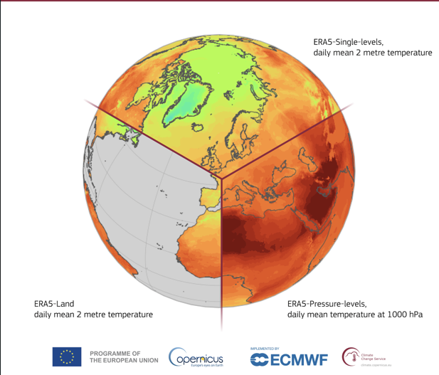
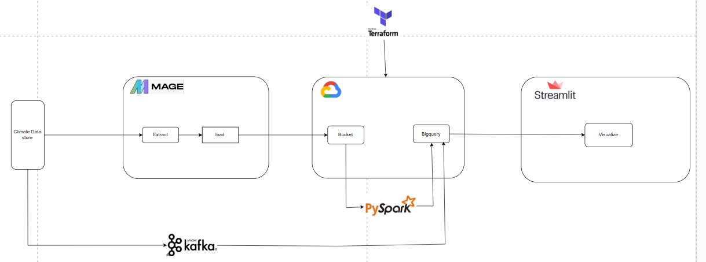
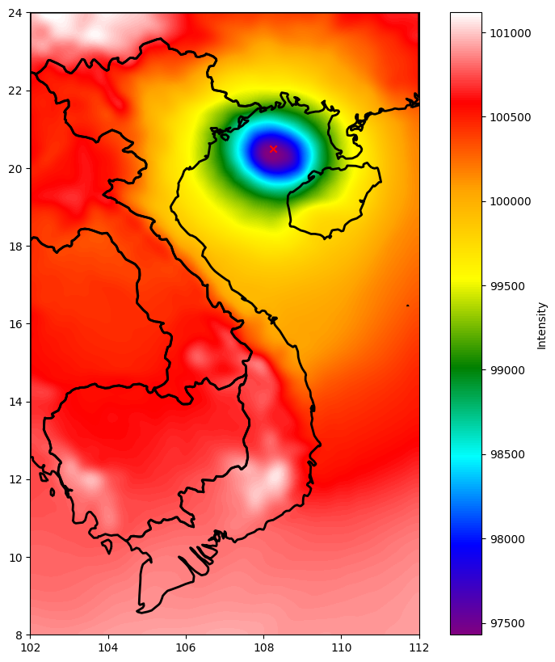

# Big Data Project - Weathers Data Analysis

## 1. Giới thiệu về project
- Trong bối cảnh biến đổi khí hậu toàn cầu đang diễn ra ngày càng phức tạp, việc nghiên cứu và phân tích dữ liệu khí hậu đã trở thành một yếu tố quan trọng để hỗ trợ các quyết định liên quan đến quản lý tài nguyên, hoạch định chính sách và ứng phó với các thách thức môi trường. Dữ liệu khí hậu không chỉ cung cấp thông tin về các hiện tượng tự nhiên mà còn là cơ sở để dự báo và xây dựng các kịch bản về biến đổi khí hậu trong tương lai.
- Một trong những nguồn dữ liệu khí hậu đáng tin cậy và phổ biến nhất hiện nay là Climate Data Store (CDS), được phát triển bởi Trung tâm Dự báo Thời tiết Trung hạn Châu Âu(ECMWF) trong khuôn khổ chương trình Copernicus. CDS cung cấp một kho dữ liệu phong phú, bao gồm thông tin về nhiệt độ, lượng mưa, gió, độ ẩm và nhiều yếu tố khí hậu khác, với phạm vi không gian và thời gian đa dạng. 
- Nhóm tập trung nghiên cứu dữ liệu từ Climate Data Store, xây dựng pipeline tự động để thu thập, biến đổi và biểu diễn dữ liệu phục vụ phân tích. Mage được dùng để tải dữ liệu từ web lên GCS và BigQuery, sau đó làm sạch và biến đổi bằng Spark. Dữ liệu được trực quan hóa qua Streamlit, đồng thời giả lập xử lý streaming bằng Kafka.
## 2. Dataset
- Dữ liệu thời tiết được lấy từ website Climate Data Store và được tổ chức theo giờ: [climate data store](https://cds.climate.copernicus.eu/datasets/reanalysis-era5-single-levels)
- Dữ liệu đưuọc lấy trong khoảng thời gian từ 01/01/2022 – 31/10/2024 và trong phạm vi Việt Nam
- Kích thước dữ liệu 15GB với gần 80000000 bản ghi
- Các trường dữ liệu bao gồm:
<table>
  <thead>
    <tr style="background-color: #f0f8ff; text-align: left;">
      <th><strong>Thông số</strong></th>
      <th><strong>Mô tả</strong></th>
    </tr>
  </thead>
  <tbody>
    <tr>
      <td>time</td>
      <td>thời gian đo</td>
    </tr>
    <tr>
      <td>latitude</td>
      <td>vĩ độ</td>
    </tr>
    <tr>
      <td>longitude</td>
      <td>kinh độ</td>
    </tr>
    <tr>
      <td>10m u-component of wind</td>
      <td>thành phần gió theo hướng đông – tây tại độ cao 10 mét</td>
    </tr>
    <tr>
      <td>10m v-component of wind</td>
      <td>thành phần gió theo hướng bắc – nam</ tại độ cao 10 mét</td>
    </tr>
    <tr>
      <td>2m dewpoint temperature</td>
      <td>nhiệt độ điểm sương ở độ cao 2 mét</td>
    </tr>
    <tr>
      <td>2m temperature</td>
      <td>nhiệt độ không khí ở độ cao 2 mét</td>
    </tr>
    <tr>
      <td>mean sea level pressure</td>
      <td>áp suất trung bình tại mực nước biển</td>
    </tr>
    <tr>
      <td>sea surface temperature</td>
      <td>nhiệt độ bề mặt nước biển</td>
    </tr>
    <tr>
      <td>surface pressure</td>
      <td>áp suất bề mặt tại điểm đo (trên mặt đất hoặc trên mặt biển)</td>
    </tr>
    <tr>
      <td>total cloud cover</td>
      <td>tổng độ che phủ của mây</td>
    </tr>
    <tr>
      <td>total column cloud ice water</td>
      <td>tổng lượng nước trong cột khí quyển ở dạng tinh thể băng</td>
    </tr>
    <tr>
      <td>total column cloud liquid water</td>
      <td>tổng lượng nước trong cột khí quyển ở dạng tinh thể lỏng</td>
    </tr>
    <tr>
      <td>total precipitation</td>
      <td>lượng mưa</td>
    </tr>
  </tbody>
</table>

## 3. Công nghệ sử dụng và kiến trúc hệ thống

- Docker: Đóng gói code và các thư viện cần thiết để chạy pipeline.
- Mage: Lập lịch và quản lý luồng.
- Google Cloud Platform (GCP):
   - Google Cloud Storage (GCS): data lake chứa dữ liệu thô.
   - Google BigQuery: data warehouse chứa dữ liệu đã được làm sạch và biến đổi.
- Spark: làm sạch, biến đổi và chuẩn bị dữ liệu cho mục đích phân tích
- Terraform: triển khai hệ thống lên GCP.
- Streamlit: trực quan hóa dữ liệu.

## 4. Các bước thực hiện
 - Xem chi tiết các bước thực hiện trong [docs](./reproduce.md)
## 5. Kết quả
- [Link to demo](link)

